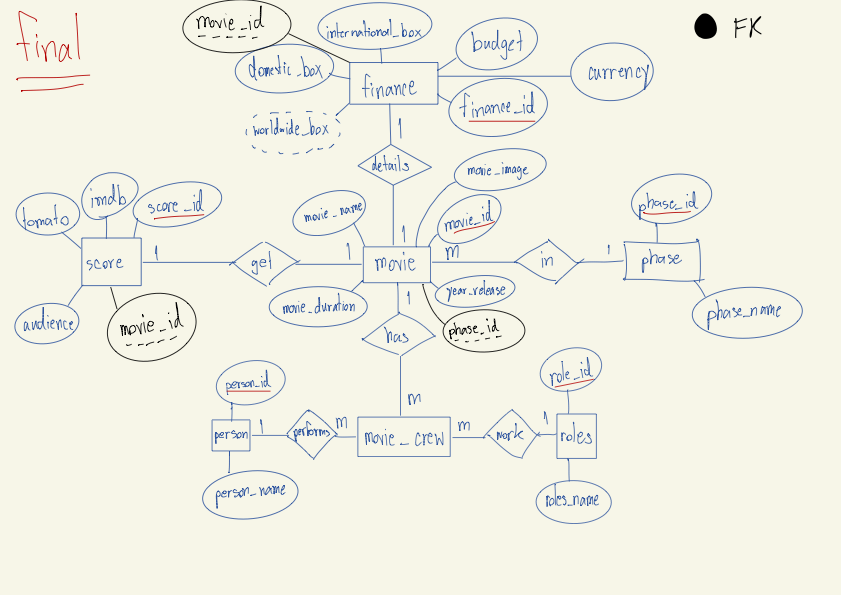
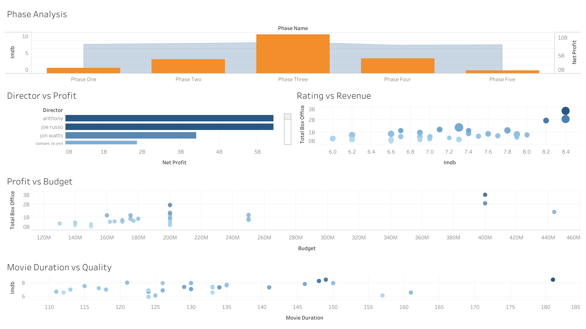

# MCU Cinematic Universe Data Warehouse and Analysis

โปรเจกต์นี้ผมเริ่มต้นจากการนำ dataset ของภาพยนตร์ MCU มาจากเว็บ kaggles มาทำการ **Data Modeling** ใหม่เพื่อเปลี่ยนจากตารางเดียวให้เป็น relational database เพื่อรองรับการวิเคราะห์ที่ซับซ้อน และนำไปสร้าง interactive dashboard เพื่อหา insight ทางการเงินและคำวิจารณ์

## 1.Database Design (ER Diagram)
ทำการ Normalization เพื่อแยก Entity ออกเป็นตารางย่อย เพื่อลดความซ้ำซ้อนของข้อมูลและเพิ่มความสะดวกในการจัดการข้อมูล Data Integrity

## Key Design Features:
1. **Many-to-Many Relationship:** ใช้ตาราง 'movie_crew' เพื่อเชื่อมโยงระหว่างภาพยนตร์และทีมงาน(director/producer)
2. **One-to-One Relationship:** แยกตาราง 'finance' และ 'score' ที่เชื่อมกับ ตาราง 'movie'
3. **Data Constraints:** มีการใช้ 'primary Key', 'foreign Key'

## 2.Data Pipeline and SQL Techniques
ผมใช้ SQL ในการจัดการข้อมูลตั้งแต่ขั้นตอน Staging ไปจนถึงขั้นตอนสุดท้าย โดยมีเทคนิคที่สำคัญดังนี้:

1. **Data Cleaning:** ใช้ 'replace' และ 'trim' เพื่อกรองชื่อบุคคลและสัญลักษณ์พิเศษ
2. **Dynamic Extraction:** ใช้ 'string_to_array' กับ 'unnest' เพื่อแยกรายชื่อผู้กำกับและโปรดิวเซอร์ที่อยู๋รวมกันมาให้เเยกชื่อคนทีละคนออกมาเป็นรายบรรทัด

> 📂 *โค้ด SQL:* 'mcu.sql'

## 3.Interactive Dashboard and Insights
ข้อมูลที่ผ่านการ cleansing แล้วนำไป Visualize ด้วย โปรเเกรม **Tableau** สร้าง dashboard เพื่อดูภาพรวมและเจาะลึกข้อมูลรายภาพยนตร์ได้

### Key Insights :
1. **Financial Performance** Phase 3 เป็นช่วงที่ทำกำไรสูงสุดอย่างก้าวกระโดดเมื่อเทียบกับ phase อื่นๆ
2. **Critical Success** ภาพยนตร์ที่มีคะแนนจากฝั่ง audience สูงมักจะมีรายได้แบบ domestic box office สูงตามกัน
3. **Director Impact** สามารถระบุผู้กำกับที่คุม budget ได้อย่างมีประสิทธิภาพและสร้างผลตอบแทนได้ดีที่สุด

> 🔗 [ลิ้ง tableau ครับ](https://public.tableau.com/app/profile/narawin.chotivit/viz/MCUanalysis_17728150843420/Dashboard1?publish=yes)
